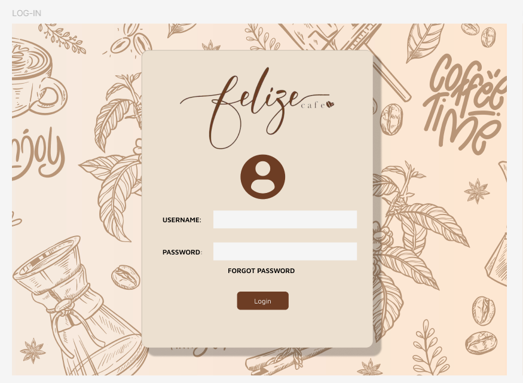
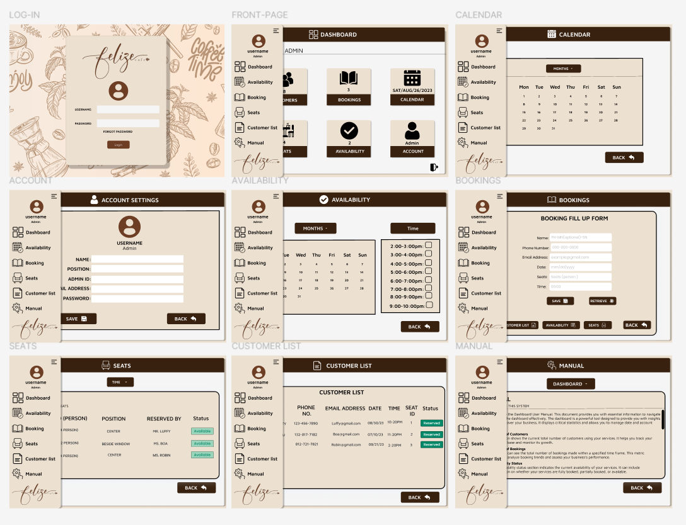

# Coffee-shop-booking-UI-UX
Coffee Shop Booking System UI/UX Design is a web-based, high-fidelity Figma prototype for managing seat reservations and customer bookings at a coffee shop. The interface is designed to be simple and interactive, with a real-time seat availability system, calendar view for easy booking management, and intuitive forms for customer reservations.

This repository contains the **UI/UX design** for the **Coffee Shop Booking System**, created using **Figma**. The design includes a high-fidelity prototype featuring a clean, interactive, and user-friendly interface for booking management in a coffee shop.

Check out the live high-fidelity prototype here:

[View the Figma Prototype](https://www.figma.com/proto/nj2HOGSsK8RnI2iDKtRr52/Coffee-Shop-Booking-UI%2FUX?node-id=1-2&starting-point-node-id=1%3A2)

## Features
- Clean and intuitive user interface for managing bookings and seat reservations.
- Real-time availability of seats.
- Calendar view to track and manage bookings.
- Interactive forms for booking customers and managing customer lists.

## Technologies
- **Design Tool:** Figma
- **Frontend Technologies (for implementation):** HTML, CSS, JavaScript

## Preview Image

## How to Use
Clone or download the design files and implement them in your web-based Coffee Shop Booking System project.

## Contribute
Fork this repository to make improvements or adjustments to the design. Pull requests are welcome!

## License
This project is licensed under the **MIT License**.
